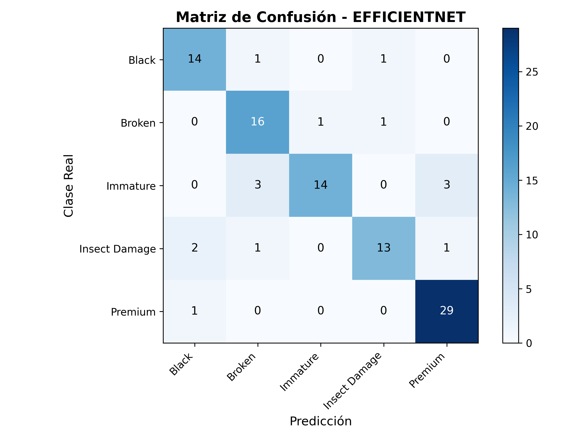
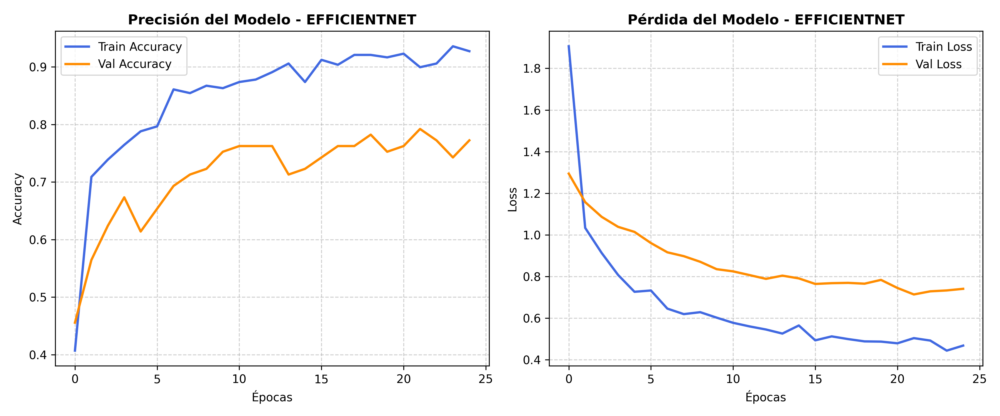
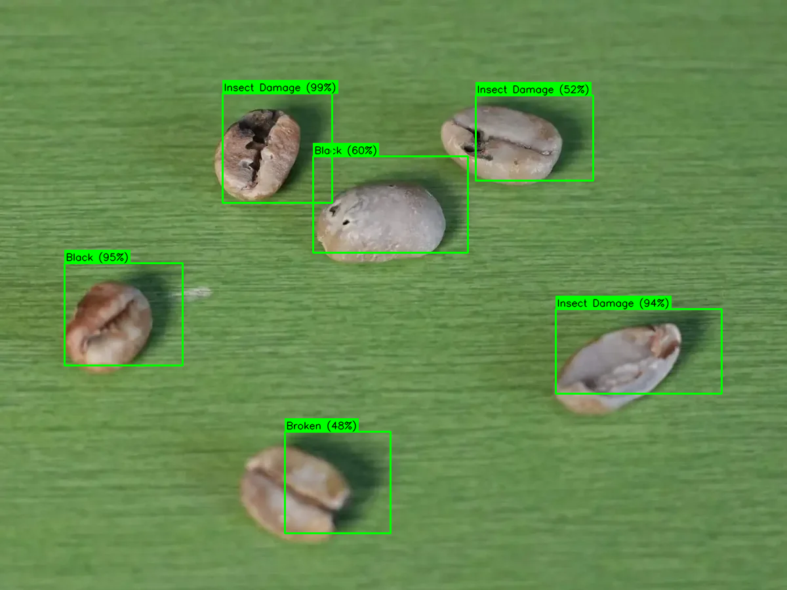
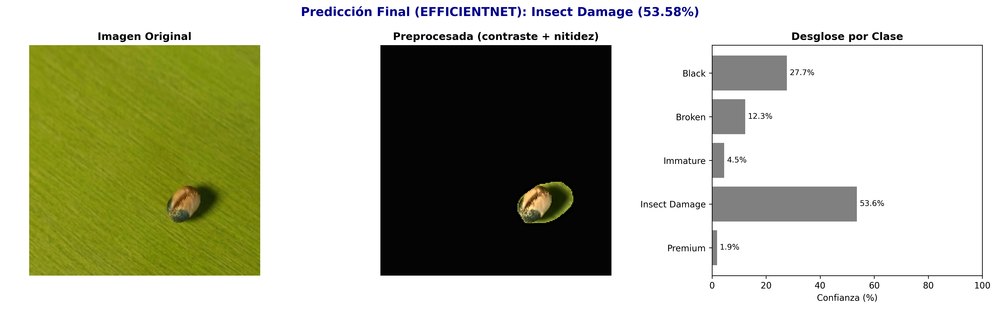

# CoffeeBeans-CNNs

Sistema de clasificación multiclase de granos de café arábica mediante Redes Neuronales Convolucionales (CNN) y Transfer Learning.

El proyecto clasifica imágenes de granos de café arábica en cinco categorías (una condición Premium y cuatro defectos físicos), entrenando cuatro arquitecturas CNN preentrenadas bajo exactamente los mismos hiperparámetros y comparando su desempeño mediante métricas estándar de clasificación.

## 📌 Descripción

La identificación de defectos en granos de café mediante inspección visual manual puede ser un proceso lento, subjetivo y dependiente de la experiencia del evaluador.

Este proyecto propone un sistema de visión artificial capaz de recibir una imagen de uno o varios granos de café y clasificarlos automáticamente en una de las siguientes categorías:

- Premium
- Black
- Broken
- Immature
- Insect Damage

El sistema utiliza técnicas de aprendizaje profundo y Transfer Learning para aprovechar modelos CNN preentrenados en ImageNet (MobileNetV2, ResNet50, EfficientNetB3 y VGG16), congelando su backbone convolucional y entrenando únicamente una cabeza de clasificación nueva. El preprocesamiento aísla el grano de su fondo con procesamiento clásico de imagen (OpenCV), tanto en entrenamiento como en inferencia, para que el modelo no dependa del fondo de la foto.

## 🎯 Objetivo

Desarrollar y comparar, bajo condiciones homogéneas, cuatro arquitecturas de Redes Neuronales Convolucionales mediante Transfer Learning, capaces de clasificar imágenes de granos de café arábica en cinco categorías, e identificar cuál ofrece el mejor equilibrio de exactitud y generalización para este dominio.

## 🧩 Clases

| Clase | Descripción |
|---|---|
| `Premium` | Granos de café arábica sin defectos visibles |
| `Black` | Granos con presencia de coloración negra (defecto crítico) |
| `Broken` | Granos fragmentados o partidos |
| `Immature` | Granos que no alcanzaron su madurez |
| `Insect Damage` | Granos con daños ocasionados por insectos |

## 📊 Dataset

El conjunto de datos utilizado en el proyecto, denominado `coffee_union_dataset`, fue construido combinando dos fuentes públicas de imágenes de granos de café. En total reúne **669 imágenes** distribuidas de la siguiente forma:

| Clase | Imágenes (total) |
|---|---:|
| Premium | 200 |
| Immature | 132 |
| Broken | 119 |
| Insect Damage | 112 |
| Black | 106 |
| **Total** | **669** |

El dataset presenta un desbalance moderado entre clases (Premium casi duplica a Black), que se compensa durante el entrenamiento mediante pesos de clase (ver sección de Hiperparámetros).

### Fuentes

- **USK-Coffee**
  - Sitio oficial: https://coffee.comvislab-usk.org/

- **Coffee Green Bean with 17 Defects**
  - Kaggle: https://www.kaggle.com/datasets/sujitraarw/coffee-green-bean-with-17-defects-original

Se seleccionaron únicamente las clases necesarias para el alcance definido del proyecto.

## 🔄 División de datos

El dataset se divide **antes** de aplicar Data Augmentation, para evitar fuga de información entre subconjuntos (`src/data/prepare_dataset.py`).

| Subconjunto | Porcentaje | Imágenes |
|---|---:|---:|
| Train | 70% | 467 |
| Validation | 15% | 101 |
| Test | 15% | 101 |

El conjunto de prueba se mantiene completamente separado y no participa en el entrenamiento ni en el ajuste de hiperparámetros.

## ⚙️ Pipeline

El sistema sigue el siguiente flujo:

```text
Imagen del grano
       │
       ▼
Carga de datos (prepare_dataset.py)
       │
       ▼
Train / Validation / Test (70/15/15, split por clase)
       │
       ▼
Preprocesamiento (preprocessing.py)
       │
       ├── Aislar el grano del fondo (umbral de Otsu + contornos)
       ├── Resize 224 × 224
       ├── Denoise (fastNlMeansDenoisingColored)
       ├── CLAHE sobre canal de luminancia (contraste local)
       ├── Unsharp mask suave (realce de nitidez)
       └── Normalización específica por arquitectura (preprocess_input)
       │
       ▼
Data Augmentation (solo train: flip, rotación, zoom, contraste, brillo)
       │
       ▼
Balanceo de clases (class_weight="balanced", aplicado en la función de pérdida)
       │
       ▼
Transfer Learning (backbone congelado + cabeza densa nueva)
       │
       ├── MobileNetV2
       ├── ResNet50
       ├── EfficientNetB3
       └── VGG16
       │
       ▼
Entrenamiento (Adam, categorical cross-entropy con label smoothing,
               EarlyStopping)
       │
       ▼
Evaluación sobre Test
       │
       ├── Accuracy
       ├── Precision Macro
       ├── Recall Macro
       ├── F1-Score Macro
       └── Matriz de Confusión
       │
       ▼
Comparación de arquitecturas (compare_architectures.py)
       │
       ▼
Inferencia: un grano (predict.py) o varios granos en una foto (predict_multiple.py)
       │
       ▼
Clase predicha + confianza por grano
```

## 🎛️ Hiperparámetros compartidos

Para que la comparación entre arquitecturas sea justa, **las cuatro se entrenan con exactamente los mismos hiperparámetros** (`src/utils/config.py`). Estos valores se determinaron mediante una búsqueda en grilla sobre un modelo *proxy* (MobileNetV2, evaluado solo en validación) — ver `src/models/hyperparam_search.py` y `results/reports/busqueda_hiperparametros.txt`.

| Hiperparámetro | Valor |
|---|---:|
| Tamaño de imagen | 224 × 224 × 3 |
| Batch size | 32 |
| Optimizador | Adam |
| Learning rate | 1e-3 |
| Épocas máximas | 25 (con Early Stopping) |
| Dropout (cabeza) | 0.4 |
| Regularización L2 (capa de salida) | 1e-4 |
| Label smoothing | 0.05 |
| Paciencia Early Stopping | 5 épocas (monitorea `val_loss`) |
| Pesos de clase | `balanced` (sklearn), recalculados por conteo real de train |
| Semilla | 42 |

## 🧊 Capas congeladas

En las cuatro arquitecturas, el backbone preentrenado en ImageNet se carga con `include_top=False` y se congela por completo (`base.trainable = False`), forzando además `training=False` en la llamada al backbone para que sus capas `BatchNormalization` usen las estadísticas de ImageNet y no las del mini-batch actual. Solo se entrena una cabeza de clasificación nueva y común a todas las arquitecturas: `GlobalAveragePooling2D → BatchNormalization → Dropout(0.4) → Dense(5, softmax, L2=1e-4)`.

## 🏗️ Estructura del proyecto

```
CoffeeBeans-CNNs/
│
├── data/
│   ├── raw/
│   │   └── coffee_union/          # Datos originales por clase
│   │
│   └── processed/
│       └── train | val | test/    # Dataset dividido (generado, no versionado)
│
├── models/
│   ├── mobilenet/
│   ├── resnet/
│   ├── efficientnet/
│   ├── vgg/
│   │   ├── weights.h5             # Pesos entrenados (Git LFS)
│   │   └── model_config.json      # Hiperparámetros, clases, pesos de clase e historial
│
├── src/
│   ├── data/
│   │   ├── loader.py              # tf.data pipeline (carga, preprocesa, aumenta, batchea)
│   │   ├── preprocessing.py       # Aísla el grano del fondo + realce + normalización
│   │   └── prepare_dataset.py     # División train/val/test
│   │
│   ├── models/
│   │   ├── model_builder.py       # Construcción de los 4 modelos de transfer learning
│   │   ├── train.py               # Entrenamiento (una arquitectura o --all)
│   │   ├── evaluate.py            # Evaluación sobre test + métricas + gráficas
│   │   ├── compare_architectures.py  # Tabla comparativa entre las 4 arquitecturas
│   │   └── hyperparam_search.py   # Búsqueda de hiperparámetros compartidos (proxy)
│   │
│   ├── inference/
│   │   ├── predict.py             # Inferencia sobre un solo grano (selector de archivo)
│   │   └── predict_multiple.py    # Inferencia sobre varios granos en una misma foto
│   │
│   ├── utils/
│   │   └── config.py              # Rutas e hiperparámetros compartidos
│   │
│   └── visualize_pipeline.py      # Gráficas del dataset y del pipeline de preprocesamiento
│
├── results/
│   ├── figures/                   # Matrices de confusión, curvas de entrenamiento, inferencias
│   └── reports/                   # Reportes .txt/.csv de métricas y comparaciones
│
├── environment.yml
├── requirements.txt
└── README.md
```

## 🛠️ Instalación (desde `git clone`)

El proyecto fue desarrollado en **Python 3.9** sobre Windows, con GPU (CUDA 11.2 / cuDNN 8.1) y **TensorFlow 2.10.1** (última versión de TensorFlow con soporte nativo de GPU en Windows). Los pesos entrenados (`weights.h5`) se versionan con **Git LFS**.

1. Instalar Git LFS una sola vez por máquina (si no está instalado):

```bash
git lfs install
```

2. Clonar el repositorio (Git LFS descarga los `.h5` automáticamente si ya está instalado):

```bash
git clone https://github.com/MelissaFloresA/CoffeeBeans-CNNs.git
cd CoffeeBeans-CNNs
```

3. Si los `weights.h5` quedaron como punteros de texto en vez de los pesos reales (repos clonados antes de instalar Git LFS), forzar la descarga:

```bash
git lfs pull
```

4. Crear el entorno. Con conda (usa `environment.yml`):

```bash
conda env create -f environment.yml
conda activate dvc-tf
```

O bien, con pip (`requirements.txt`) sobre un entorno Python 3.9 ya creado:

```bash
pip install -r requirements.txt
```

Librerías principales: `tensorflow==2.10.1`, `keras==2.10.0`, `opencv-python==4.11.0.86`, `numpy==1.24.0`, `pandas==2.2.3`, `scikit-learn==1.6.1`, `matplotlib==3.9.4`, `h5py==3.14.0`.

## 🚀 Uso

### Solo inferencia (con los modelos ya entrenados del repo)

No hace falta descargar el dataset ni reentrenar nada — `models/<architecture>/weights.h5` ya viene en el repo vía Git LFS.

```bash
# Un solo grano (abre un explorador de archivos)
python src/inference/predict.py --architecture efficientnet

# Varios granos en una misma foto
python src/inference/predict_multiple.py --architecture efficientnet
```

`--architecture` acepta `mobilenet`, `resnet`, `efficientnet` o `vgg`.

### Pipeline completo (si se quiere reentrenar)

```bash
# 1. Dividir el dataset crudo en train/val/test
python src/data/prepare_dataset.py

# 2. (Opcional) Buscar hiperparámetros compartidos sobre el modelo proxy
python src/models/hyperparam_search.py

# 3. Entrenar una arquitectura o las cuatro en secuencia
python src/models/train.py --architecture mobilenet
python src/models/train.py --all

# 4. Evaluar sobre el set de test (genera reportes, CSV y gráficas)
python src/models/evaluate.py --all

# 5. Comparar las 4 arquitecturas ya entrenadas
python src/models/compare_architectures.py

# 6. Inferencia sobre imágenes nuevas
python src/inference/predict.py --architecture efficientnet
python src/inference/predict_multiple.py --architecture efficientnet
```

El paso 1 requiere `data/raw/coffee_union/` con las 5 subcarpetas de clase (no se versiona en el repo por tamaño; ver enlaces en la sección Dataset).

## 📈 Resultados (test set, 101 imágenes)

| Arquitectura | Accuracy | Precision (macro) | Recall (macro) | F1 (macro) |
|---|---:|---:|---:|---:|
| ResNet50 | 84.2% | 0.825 | 0.830 | 0.826 |
| EfficientNetB3 | 84.2% | 0.844 | 0.832 | 0.832 |
| VGG16 | 83.2% | 0.815 | 0.820 | 0.816 |
| MobileNetV2 | 76.2% | 0.748 | 0.752 | 0.747 |

ResNet50 y EfficientNetB3 empatan en accuracy de test, pero **EfficientNetB3 es el modelo recomendado**: al probar ambos con fotos reales fuera del dataset (fondos y condiciones distintas a las de entrenamiento), ResNet50 mostró sesgo hacia predecir la clase mayoritaria (`Premium`) incluso en granos con defectos visibles evidentes, mientras que EfficientNetB3 mantuvo predicciones más coherentes con lo observado. El accuracy de test por sí solo no capturó esta diferencia, solo se detectó con pruebas cualitativas sobre imágenes nuevas. Reportes detallados por clase, matrices de confusión y curvas de entrenamiento están en `results/reports/` y `results/figures/`.

## 🖼️ Resultados visuales

<table>
<tr>
<td><br><sub>Matriz de confusión — EfficientNet</sub></td>
<td><br><sub>Curvas train/val — EfficientNet</sub></td>
</tr>
<tr>
<td colspan="2"><br><sub>Inferencia sobre varios granos en una misma foto</sub></td>
<td colspan="2"><br><sub>Inferencia sobre un solo grano, imagen fuera de dataset</sub></td>
</tr>
</table>

## 📄 Licencia y autoría

Proyecto académico de clasificación de granos de café arábica mediante CNN y Transfer Learning.
